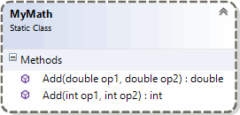

# Statisk addition

- [Gitbook](https://coursepress.gitbooks.io/objektorienterad-programmering-1dv024/content/ovningsuppgifter/statisk-addition/)

Komplettera det ofullständiga projektet ”StaticAdding” med den statiska klassen `MyMath` så att metoden `Main` kan kompileras och exekveras utan problem.

Klassen `MyMath` ska ha två statiska metoder, som båda ska heta `Add` men ha olika parameterlistor och därmed olika signaturer. Den ena metoden ska returnera summan av två heltal av typen `int`, och den andra metoden ska returnera summan av två flyttal av typen `double`.

Metoden `Main` i klassen `Program` får du inte ändra på något sätt. Koden ska oförändrad kunna använda de statiska metoderna i klassen `MyMath` som du ska implementera (skriva).

<figure>

<figcaption>
Figur 1. Klassdiagram över den statiska klassen <code>MyMath</code> med två statiska metoder.
</figcaption>
</figure>

```c#
using System;

namespace StaticAdding
{
    class Program
    {
        /// <summary>
        /// Startpunkt för applikationen.
        /// </summary>
        static void Main()
        {
            // Vilken statisk metod anropas?
            int sum = MyMath.Add(123, 456);
            Console.WriteLine($"Summan är: {sum}\n");

            // Vilken statisk metod anropas?
            double anotherSum = MyMath.Add(9.87, 6.54);
            Console.WriteLine($"Summan är: {anotherSum}\n");

            // Vilken statisk metod anropas?
            Console.WriteLine("Summan är: {0}\n", MyMath.Add(123, 6.54));
        }
    }
}
```

Fundera lite över vilken av de två statiska metoderna som kommer att anropas av de olika satserna. Vad är det som bestämmer det? Jo, typen som argumenten är av. Nog med ledtrådar…

## Mål

Efter att ha gjort övningsuppgiften ska du känna till:

- Allmänt om metoder i kurslitteraturen, kapitel 4, främst under rubrikerna ”_Calling a Method_” och ”_Declaring a Method_”.
- Överlagring av metoder i kurslitteraturen, kapitel 4, under rubriken ”_Method Overloading_”.
- Statiska metoder behandlas i kurslitteraturen, kapitel 5, under underrubriken ”_Static Methods_”. Online-hjälpen ”_Static Classes and Static Class Members (C# Programming Guide)_”, http://msdn.microsoft.com/en-us/library/79b3xss3.aspx får komplettera.

## Tips

Läs om:

- variabler i kurslitteraturen, kapitel 1, under rubriken ”_Working with Variables_”.
- olika typer av data i kurslitteraturen, kapitel 2, under rubriken ”_Fundamental Numeric Types_”.
- enkla aritmetiska operatorer i kurslitteraturen, kapitel 3, under rubriken ”_Operators_”.

Genom att läsa online-dokumentationen kan du lista ut hur du ska skriva för att ett flyttal ska presenteras med en decimals onoggrannhet. Men det kan vara lite snårigt att hitta så här har du ett hett tips för att skriva en variabel av typen `double` med namnet `myFloatingPointNumber`: `Console.WriteLine($"{myFloatingPointNumber:f1}");`.

## Lösningsförslag

- [https://github.com/1dv024/exercise-solution-proposals/tree/master/exercise-static-adding](https://github.com/1dv024/exercise-solution-proposals/tree/master/exercise-static-adding)
